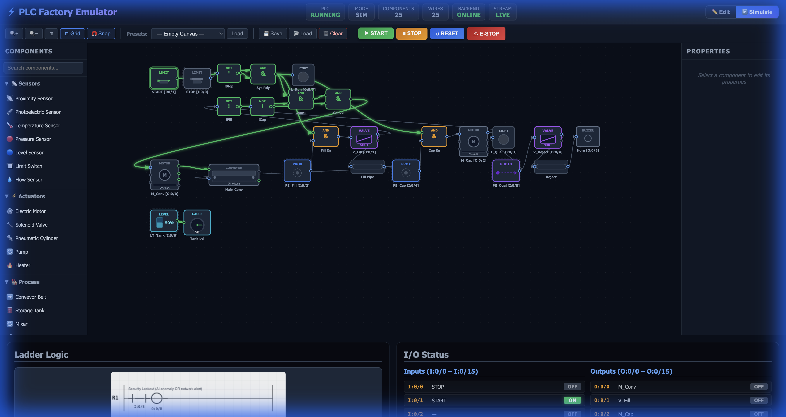
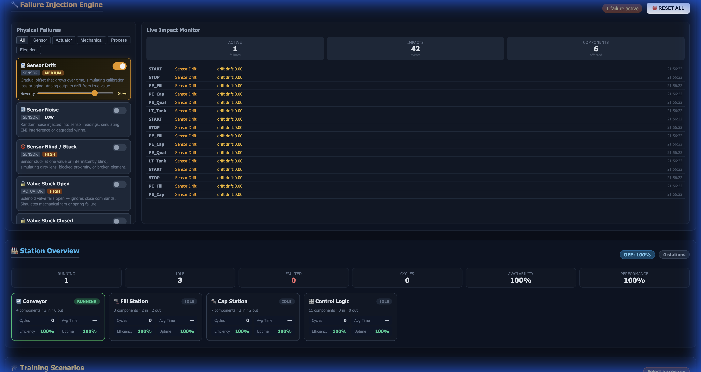
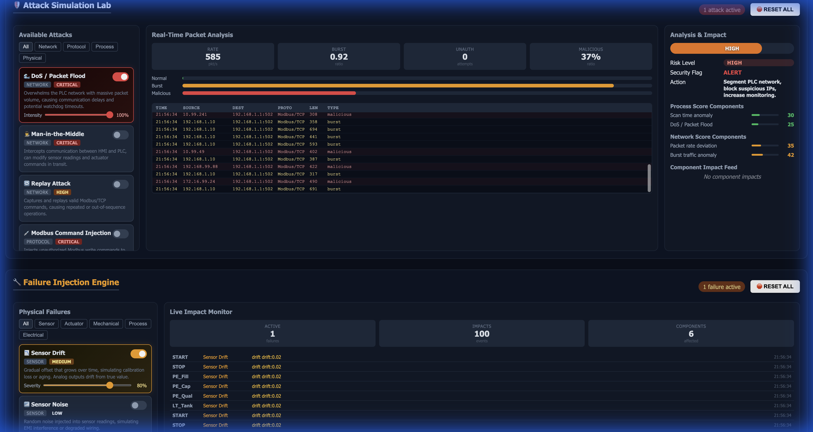
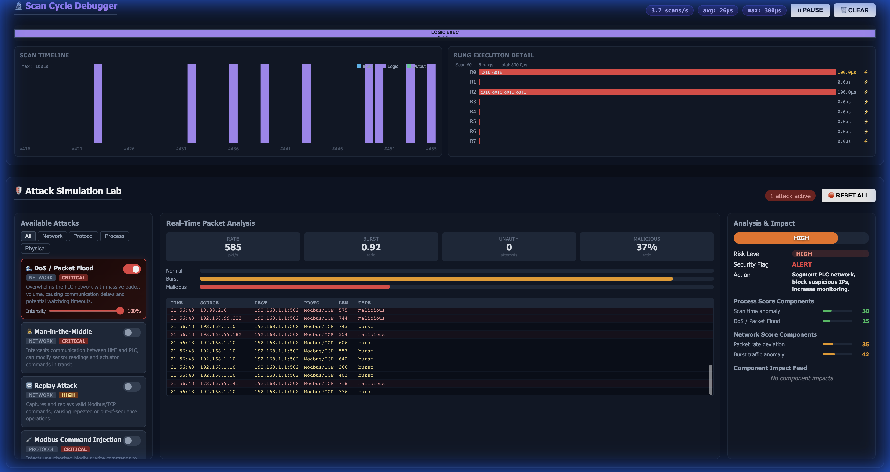
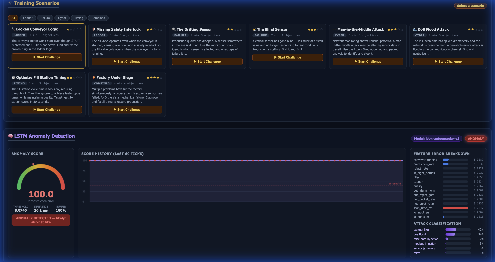
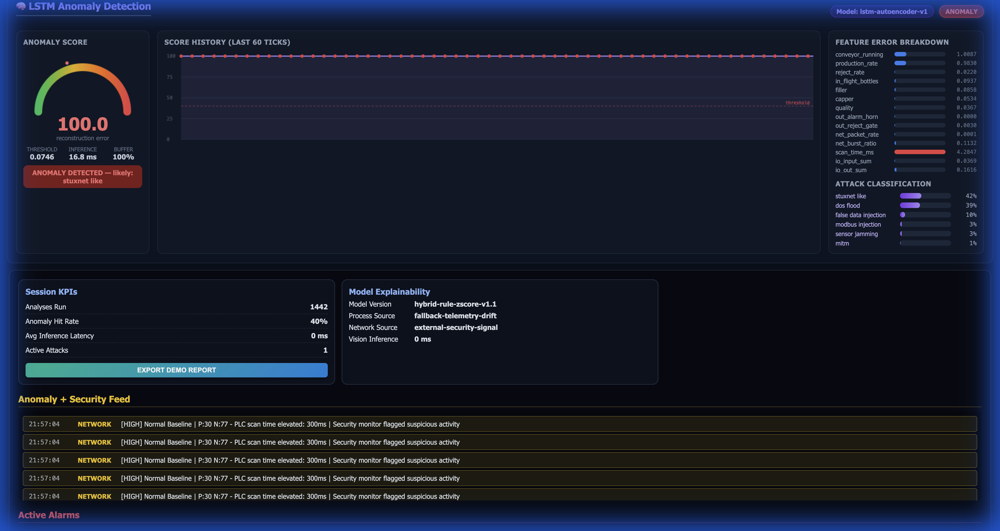

# Visual Walkthrough & Features Guide 📸

This guide provides a visual tour of the key features and panels within the PLC Factory Emulator.

---

## 1. Main Simulation Interface
The heart of the emulator is the visual layout editor and simulation engine.

### Key Features:
- **Drag-and-Drop Editor**: Build custom factory layouts using the component palette on the left.
- **Real-Time Physics**: Watch motors spin, conveyors move items, and valves actuate with realistic physics (inertia, delays, thermal properties).
- **Live Ladder Logic**: The ladder logic panel (bottom) updates in real-time, with energized rungs glowing green.
- **Station Overview**: Auto-detected stations with KPI tracking are displayed in the monitoring panels.

---

## 2. Failure Injection Engine ⚠️
Test your system's resilience by injecting realistic industrial component failures.

### Capabilities:
- **12 Failure Modes**: Simulate common issues like sensor drift, valve sticking, motor overheating, and conveyor slips.
- **Granular Control**: Toggle individual failures and adjust their intensity.
- **Physics-Based Effects**: Failures directly impact the underlying physics model (e.g., a "leaking valve" will pass partial flow even when closed).

---

## 3. Attack Simulation Lab 🛡️
Simulate cyber-physical attacks on your ICS/SCADA infrastructure.

### Attack Types:
- **Network Attacks**: DoS / Packet Flood, Man-in-the-Middle, Replay Attacks.
- **Process Attacks**: False Data Injection, Stuxnet-Style setpoint drift.
- **Protocol Attacks**: Modbus Command Injection, PLC CPU Overload.
- **Real-Time metrics**: Monitor packet rates, bust ratios, and risk scores in real-time.

---

## 4. Scan Cycle Visual Debugger 🔬
Deep dive into the PLC's execution cycle with microsecond-precision timing.

### Insights:
- **TIMELINE Chart**: Visualize the last 40 scans, broken down by Input Read, Logic Execution, and Output Update phases.
- **Per-Rung Execution**: See exactly how long each ladder rung takes to execute.
- **Bottleneck Detection**: Identify slow rungs (highlighted in yellow/red) that are impacting scan time.

---

## 5. Training Scenario Engine 🎓
Learn and test your skills with guided challenges.

### Scenario Categories:
- **Ladder Logic**: Fix broken logic or missing interlocks.
- **Troubleshooting**: Diagnose hidden sensor failures or stuck valves.
- **Cyber Defense**: Identify and mitigate active cyber attacks.
- **Scoring**: Earn points based on time and hints used.

---

## 6. LSTM Anomaly Detection (AI/ML) 🧠
Leverage deep learning to detect sophisticated attacks and anomalies.

### Advanced Analytics:
- **Anomaly Score**: A real-time gauge showing the reconstruction error from the LSTM Autoencoder.
- **Attack Classification**: The system classifies the likely attack type (e.g., "DoS Flood", "Stuxnet-like") based on feature error patterns.
- **Feature Breakdown**: See which specific telemetry signals (e.g., scan time, packet rate) are deviating from the baseline.
- **Score History**: Track the anomaly score over time to identify trends and bursts.
